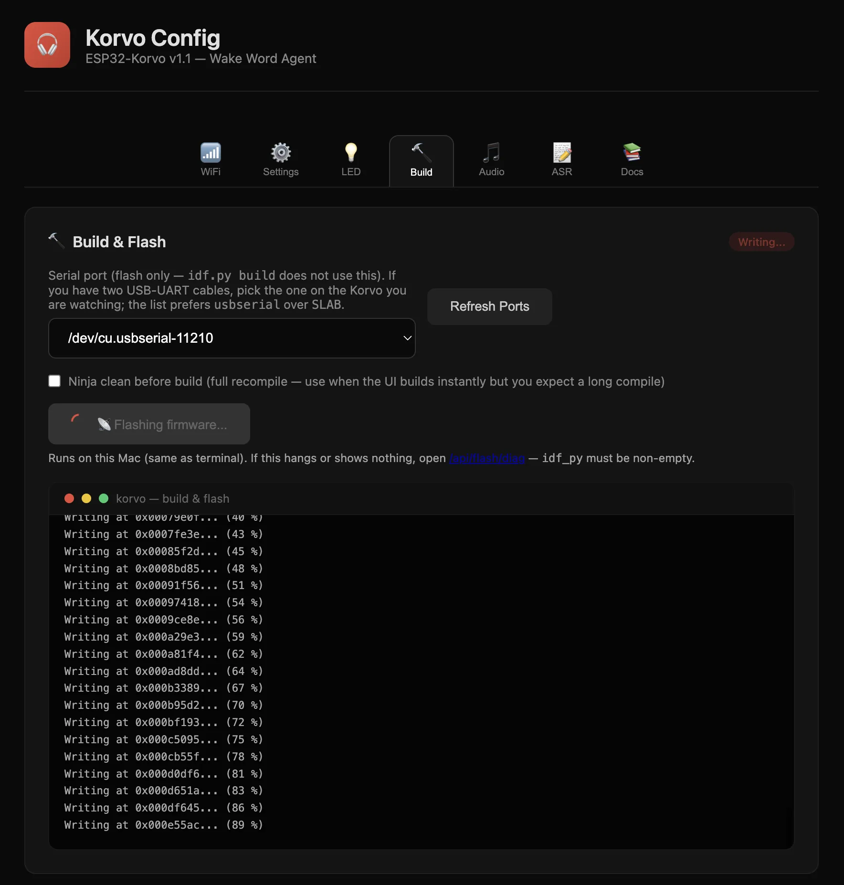
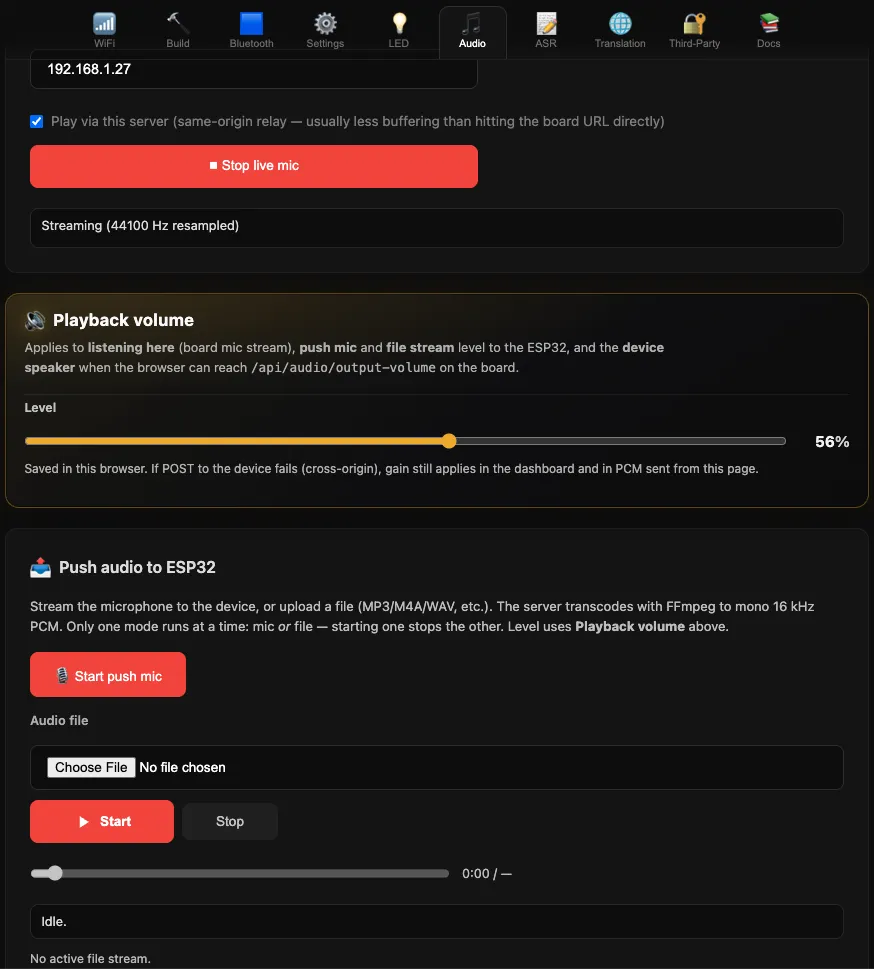

<p align="center">
  
</p>

<h1 align="center">Korvo Toolkit</h1>

<p align="center">
  Set up your ESP32-Korvo board, flash firmware, test audio, control LEDs, and run speech features from one clean web dashboard.
</p>

<p align="center">
  <a href="#quick-start"><strong>Quick Start</strong></a> ·
  <a href="#what-you-can-do"><strong>Features</strong></a> ·
  <a href="#dashboard-guide"><strong>Dashboard Guide</strong></a> ·
  <a href="#setup-checklist"><strong>Setup Checklist</strong></a>
</p>

---

## What this is

Korvo Toolkit gives you two things that work together:

- **Firmware** for the ESP32-Korvo board (`korvo-app/`)
- **Korvo Config dashboard** in your browser (`korvo-server/`)

If your goal is "I want my board working quickly without juggling ten tools," this repo is built for that.

---

## Who this is for

- You have an **ESP32-Korvo** board (ESP32 variant)
- You want to **flash firmware** and test features fast
- You prefer using a **browser dashboard** instead of only terminal commands

---

## Quick start

### 1) Start the dashboard

From the repo root:

```bash
./start.sh
```

Then open:

`http://localhost:3333/`

### 2) Connect your board

- Plug the board in via USB
- Open the **Build & Flash** tab
- Select the serial port
- Click **Build & Flash to Board**

### 3) Basic first-time setup

In this order:

1. **WiFi**: connect the board to your network
2. **Settings**: save basic defaults (wake word, brightness, host details)
3. **LED**: test colours and presets
4. **Audio**: test listening and audio push

If those work, your board is ready.

---

## What you can do

| | Feature | What it helps you do |
|---|---|---|
| 📶 | **WiFi setup** | Connect the board to a network quickly |
| 🧱 | **Build & Flash** | Compile and flash firmware from one button, with live terminal output |
| 🎧 | **Bluetooth output** | Send board audio to Bluetooth speakers/headphones |
| ⚙️ | **Settings** | Save board defaults in one place |
| 🌈 | **LED control** | Pick colours, apply presets, adjust brightness, test ring behavior |
| 🎙️ | **Audio tools** | Listen to board mic, adjust levels, and push mic/file audio to device |
| 📝 | **Live transcript (ASR)** | Turn board audio into live text on-screen |
| 🌍 | **Translation + speech** | Translate text and optionally play spoken output |
| 🔑 | **Third-party keys** | Add service keys used by translation and speech flows |
| 📚 | **Docs tab** | Quick links to board docs and hardware references |

---

## Dashboard guide

### WiFi
Scan for networks, enter password, and save active WiFi credentials for the board.

### Build & Flash

Pick your USB port, run build + flash, and watch progress in the built-in terminal panel.

### Bluetooth
Find nearby Bluetooth devices, connect, and set a preferred output device.

### Settings
Save your default board behavior (wake word, connection details, LED/volume defaults).

### LED

<p align="center">
  
</p>

Control the board's LED ring without reflashing:

- turn LEDs on/off
- choose preset animations
- pick exact colours from swatches or custom colour picker
- apply colour to one segment or the full ring
- set brightness

### Audio

<p align="center">
  
</p>

Use one tab for three jobs:

1. **Listen** to what the board microphones hear
2. **Set volume** for listening and playback
3. **Push audio to the board** from your mic or an uploaded file

### ASR (Live Transcript)
See live speech-to-text results while the board audio is running.

### Translation
Translate text between languages and optionally play spoken output.

### Third-Party
Store and validate API keys used by advanced translation/speech providers.

### Docs
Open board documentation, schematics, and related references quickly.

---

## Setup checklist

Use this before your first serious test:

- [ ] Board connected by USB
- [ ] Dashboard opens at `http://localhost:3333/`
- [ ] Build & flash completes
- [ ] WiFi saved and active
- [ ] LED ring responds to colour changes
- [ ] Audio listen works
- [ ] Audio push works
- [ ] (Optional) Live transcript and translation tested

---

## What is in this repository

| Path | Purpose |
|---|---|
| `korvo-app/` | Board firmware project |
| `korvo-server/` | Local web dashboard and APIs |
| `readme/` | README screenshots |
| `start.sh` | Starts the dashboard server |
| `setup.sh` | Loads ESP-IDF environment for firmware work |
| `scripts/` | Helper scripts for local testing |

For code editors:

- Dashboard page shell: `korvo-server/korvo_server/templates/pages/dashboard.html`
- Dashboard tab partials: `korvo-server/korvo_server/templates/pages/dashboard/partials/`
- Dashboard static assets: `korvo-server/korvo_server/static/`

---

## Buy the board

Example listings for the ESP32-Korvo kit:

- [DigiKey (UK) — ESP32-KORVO](https://www.digikey.co.uk/en/products/detail/espressif-systems/ESP32-KORVO/12138980)
- [AliExpress listing](https://www.aliexpress.com/i/1005003980436945.html)

Make sure you buy the **ESP32 Korvo** variant that matches this project.

---

## More detailed docs

- Firmware details: [`korvo-app/README.md`](korvo-app/README.md)
- Server/API details: [`korvo-server/README.md`](korvo-server/README.md)

Upstream references:

- [ESP-Skainet](https://github.com/espressif/esp-skainet)
- [ESP-SR](https://github.com/espressif/esp-sr)
